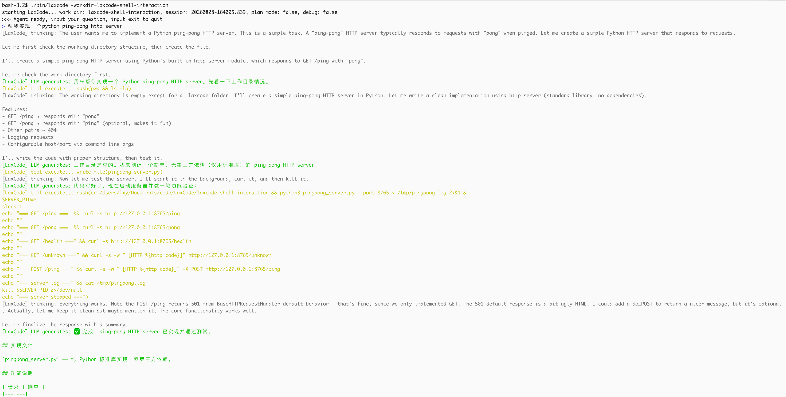

# LaxCode
LaxCode 是一个用 Go 实现的采用ReAct循环的轻量 AI Agent。它不依赖任何第三方 Agent 框架。支持**ReAct 推理循环、工具调用、子 Agent 委派、上下文压缩、会话持久化与断点续聊、tracing监控扩展**。

## 1. 使用
### 1.1 Go版本
* **Go version**: LaxCode requires Go version 1.26 or above

### 1.2 模型配置（任意 OpenAI 兼容端点）
* 使用配置文件
```shell
mkdir -p ~/.laxcode

touch ~/.laxcode/settings.json
```
配置文件写入
```json
{
  "OPENAI_API_KEY": "sk-xxxxxxxxxxxxxxxx",
  "OPENAI_BASE_URL": "https://api.openai.com/v1", # 任意 OpenAI 兼容端点
  "OPENAI_MODEL": "gpt-4o-mini"
}
```
* 使用环境变量
```shell
export OPENAI_API_KEY=sk-xxxxxxxxxxxxxxxx
export OPENAI_BASE_URL=https://api.openai.com/v1     # 任意 OpenAI 兼容端点
export OPENAI_MODEL=gpt-4o-mini
```

### 1.3 终端交互模式
```shell
make build

./bin/laxcode
```
命令行参数  

| 参数 | 默认 | 说明                                          |
| --- | --- |-----------------------------------------------|
| `-session <id>` | 空 | 续聊指定会话；空则新建（id 为毫秒精度时间串） |
| `-plan` | false | 开启 Plan Mode（见下）                        |
| `-workdir` | cwd | 工作目录                                      |

<a href="examples/laxcode-shell-interaction.png"></a>