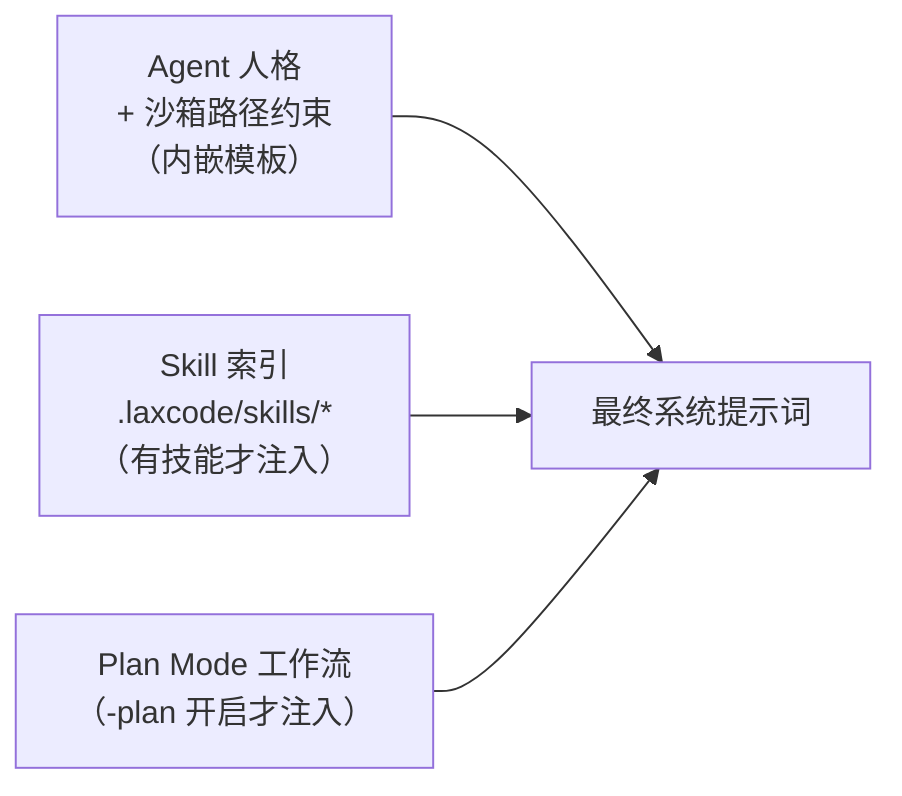
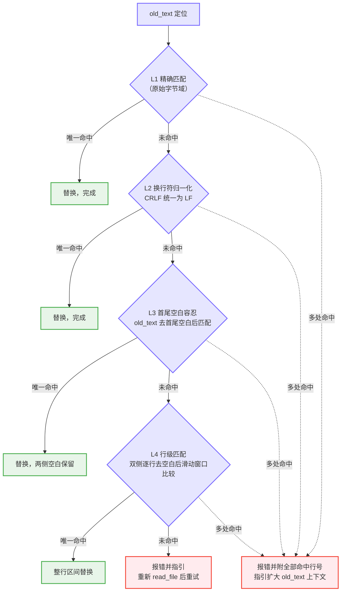

# LaxCode

LaxCode 是一个用 Go 从零实现的终端 AI 编程 Agent。它不依赖任何 Agent 框架，在一个约 4000 行的代码库里完整实现了一个编码助手的核心闭环：**ReAct 推理循环、工具调用、子 Agent 委派、上下文压缩、会话持久化与断点续聊**。项目的目标不是复刻商业产品的功能广度，而是把每个子系统都做到工程上站得住：状态有唯一真相源、故障路径有恢复策略、给模型的每一份输入都经过设计。


---

## 1. 架构

```
LaxCode/
├── cmd/main/              # 入口：装配 registry、provider、engine
├── internal/
│   ├── engine/            # ReAct 循环、会话管理、工具调度、子 Agent
│   ├── provider/          # LLM 接口抽象 + OpenAI 兼容 / Anthropic 双实现
│   ├── context/           # 系统提示词组装、Skill 索引、上下文压缩、错误提示协议
│   ├── tools/             # 工具注册表与 read/write/edit/bash 实现
│   ├── schema/            # 与模型交互的消息、工具定义等中立数据结构
│   ├── utils/             # 分页读取等无状态基础设施
│   └── env/               # 配置加载
└── openspec/              # 开发过程中的变更管理文档
```

各包之间依赖方向单一：`engine` 依赖 `provider`/`tools`/`context`，反向依赖为零；`schema` 作为中立消息结构被所有层引用，provider 实现负责在厂商 SDK 格式与内部格式之间互转。这意味着切换模型厂商不影响引擎逻辑，新增工具不需要触碰引擎代码。

### 1.1 启动与会话加载

会话持久化的设计原则是**单一真相源 + 可推导的冗余**：

- 每条消息（用户输入、模型回复、工具结果）追加即落盘为 `.laxcode/.session/<session-id>/history.jsonl` 中的一行 JSON，内存与磁盘始终同步；
- token 统计快照 `meta.json` 是纯冗余数据，用 tmp 文件 + rename 原子写入，供人直接查看；快照缺失、损坏或滞后都不影响正确性——恢复时以 history.jsonl 的单遍重放为准，重放同时推导出累计 token 消耗与窗口占用；
- 坏行跳过并告警，绝不阻断启动；单行读取缓冲上限提到 16MB，以容纳大文件读取产生的超长工具结果行；
- 系统提示词属于派生数据，不写入历史文件，每次启动按当前代码版本与 Skill 集合重建——续聊时提示词模板或技能有更新即刻生效，不存在过期缓存问题。

用 `-session <id>` 启动即续聊指定会话，缺省则以毫秒精度时间串新建。

### 1.2 系统提示词组装

系统提示词在启动时按需拼装，只包含与本次运行相关的段：



其中 **Skill 机制采用渐进式披露（progressive disclosure）**：系统提示词里只注入每个技能的一行索引（名称 + 描述），技能正文不进上下文；模型判断任务相关时，先读取 `SKILL.md` 定义文件再按其指引工作。这把「技能数量增长」与「上下文成本」解耦。技能加载有完整的校验管线（frontmatter 边界 → YAML 合法性 → 必填字段 → name 与目录一致 → 命名规范），任何一步失败只告警跳过，不阻断启动。

### 1.3 ReAct 循环

`engine.Run` 驱动「推理 → 工具调用 → 观察」循环直到模型给出无工具调用的最终回答：

- **历史唯一真相源是会话对象**：每次调用 LLM 前重拼发送视图（系统提示词 + 历史），产生的一切消息经统一入口追加写回，内存中不存在绕过会话的旁路状态；
- **turn 上限 50**：触发后返回哨兵错误，REPL 打印警告并继续等待下一轮输入，而不是静默失控或直接退出；
- **read_file 批次自动并行**：模型一次返回多个工具调用且全部为 read_file 时（只读、互不依赖），用 goroutine + 带缓冲 channel 做 fork-join 并发执行，结果按原始调用顺序归位，保证 tool_call_id 与结果一一对应；含写操作的批次退化为顺序执行，避免竞态。

### 1.4 子 Agent

`run_sub_agent` 工具把可拆分的独立子任务委派给一个全新构造的子引擎：

- 子 Agent 拥有**独立的工具注册表**（仅 bash + read_file，无写权限）与**独立会话**（id 以 `sub:` 前缀区分，同样落盘可追溯），父对话历史完全不传入——既隔离了上下文，也避免子任务撑爆父窗口；
- 子 Agent 失败时，已产出的部分结果仍会交还父 Agent，供其判断补救方向，而不是整个子任务作废。

### 1.5 上下文压缩

长会话中工具输出会迅速吃满窗口。压缩器在每次调用 LLM 前检查窗口占用，达到阈值（默认窗口的 80%）时分层清理：

- 最近的工具输出只保留头尾各 500 字节，中段以截断标注替代；
- 更早的工具输出整体替换为一行长度说明；
- 上一轮用户输入之前的模型思考链（reasoning）已对当前决策失效，直接清除；
- 压缩发生在会话内存视图上，压缩量按 token 估算回写统计。

### 1.6 Provider 抽象

`provider.Provider` 接口只有 `Generate` 一个核心方法。当前提供两个实现：OpenAI 兼容协议（DeepSeek 等，基于 Responses API）与 Anthropic。引擎与工具层完全不感知厂商差异。

---

## 2. 工具

所有文件类工具共享同一套**沙箱约束**：路径统一经 `safeJoinWorkDir` 解析，显式拒绝绝对路径、校验解析结果必须落在工作目录内，杜绝 `../` 路径穿越。工具参数用 JSON Schema 完整声明并随工具定义提供给模型。

### 2.1 read_file

| 参数 | 类型 | 说明 |
|---|---|---|
| `path` | string | 工作目录内的相对路径 |
| `start_line_no` | int | 起始行号，1-based |
| `start_bytes` | int | 起始行内字节偏移，1-based |

单次最多返回 2000 行 / 50KB。读取引擎按行流式扫描，支持任意长行（超长行分段读取再拼接）与 `\r\n` 归一。

关键的工程设计是**自描述翻页协议**：每次输出末尾附带状态标注——是否读完、最后一行行号、该行是否被截断及已读字节数，并直接给出续读参数。模型无需任何额外信息即可自行翻页继续读，不依赖对文件长度的猜测。超长行从行中间断开时，`start_line_no + start_bytes` 的二维定位能精确到字节级续读。

### 2.2 write_file

| 参数 | 类型 | 说明 |
|---|---|---|
| `path` | string | 相对路径，父目录不存在时自动创建 |
| `content` | string | 完整文件内容 |

创建或整体覆写文件，返回写入路径供模型确认。

### 2.3 edit_file

| 参数 | 类型 | 说明 |
|---|---|---|
| `path` | string | 已存在文件的相对路径 |
| `old_text` | string | 待替换原文，须与文件内容一致且在文件内唯一 |
| `new_text` | string | 替换后内容，允许为空（即删除） |

LLM 生成的 old_text 常见失真包括：缩进与源文件不符、`\r\n` 与 `\n` 混用、首尾多余空白。直接要求「逐字节精确匹配」会导致大量可修正的调用失败。edit_file 用**四级宽容降级匹配**消化这些噪声：



从 L1 到 L4 逐级放宽匹配条件，每一级命中即停止；成功返回替换的行区间与命中的匹配层级；任一级命中多处则报错并附全部行号，驱动模型扩大上下文使匹配唯一。全部落空才报错，且错误信息强制指引「先重新 read_file，禁止凭记忆盲目重试」。

### 2.4 bash

| 参数 | 类型 | 说明 |
|---|---|---|
| `command` | string | 在工作目录下执行的 bash 命令 |

面向 Agent 场景的边界处理：

- 30 秒超时，超时归类为可恢复错误并给出排查方向（拆分命令 / 检查环境），而非笼统失败；
- 输出按 rune 而非字节截断（上限 8000 字符），保证多字节中文不会被从中间切断产生乱码；
- 返回结构化结果：退出码、stdout、是否截断，命令失败（非零退出）与执行故障（进程级错误）区分处理——前者是正常的观察反馈，后者才附带纠错指引。

### 2.5 run_sub_agent

| 参数 | 类型 | 说明 |
|---|---|---|
| `task` | string | 完整、独立的子任务描述，不依赖父对话上下文 |
| `abstract` | string | 50 字以内摘要（用于终端展示） |
| `work_dir` | string | 可选，缺省继承父 Agent 工作目录 |

见 [1.4 子 Agent](#14-子-agent)。

### 2.6 错误反馈协议：让模型从错误中恢复

Agent 系统里工具失败是常态，真正拉开差距的是失败之后发生什么。盲目重试相同的错误调用会烧掉大量 token 和 turn 预算，LaxCode 为此实现了**结构化错误提示协议**（`internal/context/err_prompt.go`）：

每类工具错误在原始 error 之外携带一份给 LLM 的纠错提示词，回写会话时追加在错误信息之后，固定三字段格式：

```text
error executing tool edit_file: old_text 在文件中匹配到 2 处（第 12、45 行）...
### error_type: tool
### error_detail: old_text 在文件中匹配到 2 处（第 12、45 行），请扩大范围
### suggestion: 请扩大 old_text 范围纳入更多上下文行使其唯一后重试
```

错误类型学覆盖了工具执行的主要失败模式，每类 suggestion 都针对该失败模式的具体恢复动作：

| 错误类型 | 场景 | suggestion 的恢复指引 |
|---|---|---|
| `ParamError` | 参数缺失/非法 | 阅读工具定义后修正参数 |
| `FilePathError` | 路径穿越/绝对路径 | 检查路径格式与沙箱限制 |
| `FileNotExistError` | edit 目标不存在 | 核对路径；新建文件改用 write_file |
| `EditNotFoundError` | 四级匹配全部落空 | 强制重新 read_file，禁止凭记忆重试 |
| `EditMultiMatchError` | 匹配多处 | 附行号，扩大 old_text 上下文 |
| `FileIOError` | 权限/磁盘等系统故障 | 检查文件状态，不要盲目重试 |
| `BashExecuteError` | 进程执行故障/超时 | 列出超时、目录权限、命令语法等排查方向 |

系统提示词中同时声明了该协议，要求模型读到错误必须按 suggestion 修正后重试、禁止原样重试。工具报错时若有原始输出（如 stderr）也会一并附上，供模型自行定位。这一「错误 → 诊断 → 定向恢复」的闭环，是多 turn Agent 能真正跑完长任务的关键一环。

---

## 3. 使用

### 3.1 构建与运行

```bash
make build          # 编译到 bin/laxcode
make test           # 单元测试
make vet            # 静态检查

export OPENAI_API_KEY=sk-...
export OPENAI_BASE_URL=https://api.deepseek.com     # 任意 OpenAI 兼容端点
export OPENAI_MODEL=deepseek-chat

./bin/laxcode
```

### 3.2 命令行参数

| 参数 | 默认 | 说明 |
|---|---|---|
| `-session <id>` | 空 | 续聊指定会话；空则新建（id 为毫秒精度时间串） |
| `-plan` | false | 开启 Plan Mode（见下） |
| `-debug` | false | 输出调试日志 |

REPL 内输入 `exit` 或 Ctrl-D 退出。

### 3.3 Plan Mode

`-plan` 启动时注入一套强制的串行工作流，所有规划状态强制持久化到文件而非内存：

1. **plan.md** —— 理解目标后写完整方案（需求点、技术选型、边界风险）；
2. **design.md** —— 拆为小粒度可执行清单；
3. 逐条执行，**真正完成一条才能打钩**，禁止提前打钩、虚构完成；
4. 全部完成后将两份文档归档到 `archive/<任务名>/`。

每次进入 Plan Mode 的第一个强制动作是探测目录中是否已有 plan.md/design.md——存在则续跑未完成的任务。这让中断（会话结束、进程退出）天然可恢复，任务进度以文件为准，不依赖对话历史。

### 3.4 Skills

在工作目录放置 `.laxcode/skills/<name>/SKILL.md` 即注册一个技能：

```markdown
---
name: pdf-tools
description: 处理 PDF 的技能
---
（正文：模型读到索引后会用 read_file 读取本文件，按此处指引工作）
```

---

## 4. 测试

核心逻辑均配套单元测试：read/write/edit 工具与四级匹配引擎、分页读取（含超长行、字节级续读）、会话持久化与重放恢复、Skill 校验管线、工具调度与并行执行、系统提示词组装。`make test` 一键运行；`internal/provider` 另有一个依赖真实 API 的连通性集成测试。
