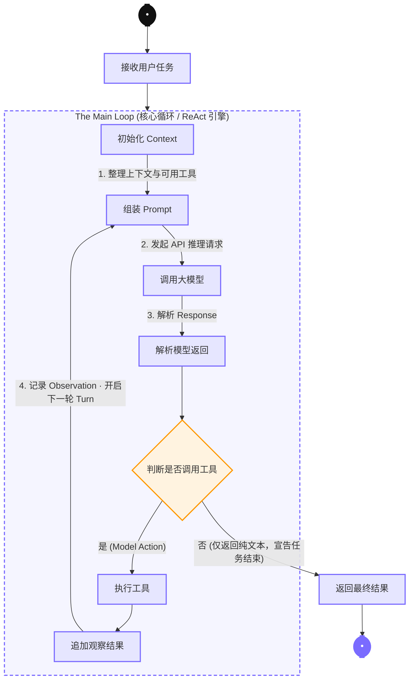

LaxCode/
├── cmd/
│   └── main/
│       └── main.go          # 程序入口
├── internal/
│   ├── engine/              # MainLoop 核心实现
│   ├── provider/            # 大模型接口抽象与具体厂商 SDK 实现
│   ├── context/             # Token 监控、Prompt 动态组装
│   ├── tools/               # 工具注册表、Middleware、基础极简工具(bash/edit等)
│   ├── memory/              # 基于文件系统的记忆状态存取
│   └── feishu/              # 飞书机器人交互回调
├── go.mod
└── README.md

## Main Loop (核心循环 / ReAct 引擎)

引擎采用 ReAct（Reasoning + Acting）模式驱动任务处理：接收用户任务后进入主循环，
在「推理 → 决策 → 行动 → 观察」之间往复，直到模型宣告任务结束。

> 说明：该图使用 Mermaid 语法，GitHub、GitLab、VS Code 等平台均可直接渲染。