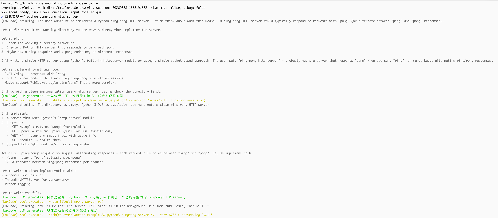
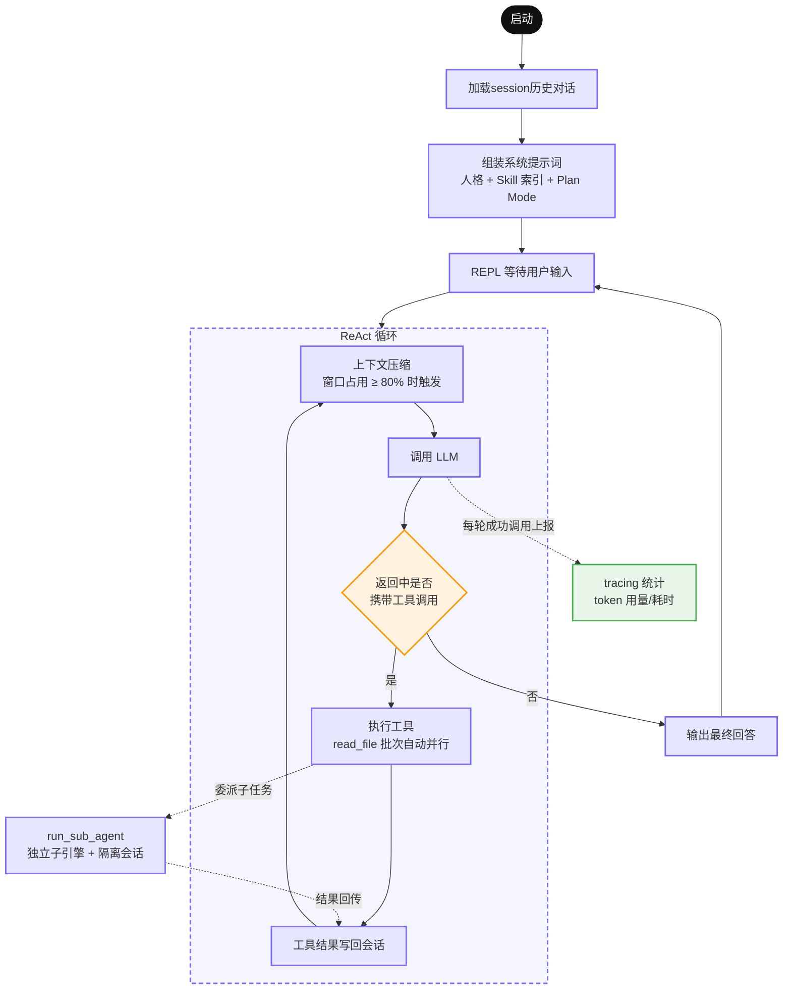

# LaxCode
LaxCode 是一个用 Go 实现的轻量 AI Agent。它不依赖任何第三方 Agent 框架。基于 ReAct 推理循环，支持**工具调用、子 Agent 委派、上下文压缩、会话持久化与断点续聊、tracing 监控扩展**。

## 1. 使用
### 1.1 Go 版本
* **Go version**: LaxCode requires Go version 1.26 or above

### 1.2 模型配置（任意 OpenAI 兼容端点）
* **使用配置文件**
```shell
mkdir -p ~/.laxcode

touch ~/.laxcode/settings.json
```
配置文件写入
```json
{
  "OPENAI_API_KEY": "sk-xxxxxxxxxxxxxxxx",
  "OPENAI_BASE_URL": "https://api.openai.com/v1", # 任意 OpenAI 兼容端点
  "OPENAI_MODEL": "gpt-4o-mini"
}
```
* **使用环境变量**
```shell
export OPENAI_API_KEY=sk-xxxxxxxxxxxxxxxx
export OPENAI_BASE_URL=https://api.openai.com/v1     # 任意 OpenAI 兼容端点
export OPENAI_MODEL=gpt-4o-mini
```

### 1.3 终端交互模式
```shell
make build

./bin/laxcode
```
命令行参数  

| 参数 | 默认 | 说明                                          |
| --- | --- |-----------------------------------------------|
| `-session <id>` | 空 | 续聊指定会话；空则新建（id 为毫秒精度时间串） |
| `-plan` | false | 开启 Plan Mode（见下）                        |
| `-workdir` | cwd | 工作目录                                      |

<a href="examples/laxcode_terminal_interaction.png"></a>

### 1.4 one-shot 模式
```shell
make build

./bin/laxcode -workdir=/tmp/laxcode-example -oneshot -session=20260828-165219.532 -task="我们之前都聊了什么?"

# stdout 结构化输出：
# {"session_id":"20260828-165219.532","result":"根据当前对话记录，我们只进行了一轮交互，内容如下：\n\n## 已完成的对话内容\n\n**你提出的任务：** 实现一个 Python ping-pong HTTP server。\n\n**我做的事情：**\n1. **查看环境** — 检查了工作目录 `/tmp/laxcode-example`（当时为空）和 Python 版本（3.9.6）。\n2. **编写代码** — 创建了 `pingpong_server.py`，基于 Python 标准库 `http.server` 实现，无第三方依赖。\n3. **测试验证** — 启动服务器并对各端点做了实测：\n   - `GET /ping` → `pong`\n   - `GET /pong` → `ping`\n   - `POST /ping` → `pong`\n   - `GET /` → 交替返回 `ping`/`pong`\n   - `GET /health` → `{\"status\": \"ok\"}`\n   - 未知路径 → 404，不支持的方法 → 405\n4. **清理** — 删除了测试产生的日志文件。\n\n期间还遇到一个小插曲：初次测试用的 8765 端口被环境里其他进程占用导致绑定失败，后改用 8877 端口验证通过。\n\n---\n\n如果你指的是**更早之前的对话**（不在本次会话上下文中），我这边没有保留那些历史记录——每次会话都是独立的，我无法访问之前的对话内容。如果你想继续，可以告诉我新需求，比如：\n- 给服务器加 WebSocket ping/pong 支持\n- 增加鉴权、限流、自定义路由\n- 打包成可部署的 Docker 镜像等\n\n需要的话随时说 😊","token_used":{"token_input":27835,"token_output":4074},"window_token":{"token_input":6348,"token_output":445},"error":null}
```
命令行参数

| 参数            | 默认  | 说明                                          |
|-----------------|-------|-----------------------------------------------|
| `-session <id>` | 空    | 续聊指定会话；空则新建（id 为毫秒精度时间串） |
| `-plan`         | false | 开启 Plan Mode（见下）                        |
| `-workdir`      | cwd   | 工作目录                                      |
| `-oneshot`      | false | 开启 oneshot 模式                               |
| `-task`         | 空    | prompt 文本                                    |
| `-task-file`    | 空    | prompt 文件，优先级高于 `-task`                  |

## 2. session 管理
支持通过指定 session id 进行断点续聊
```shell
make build

./bin/laxcode -session=xxxxx
```

### 2.1 session 持久化
session 目录结构
```text
${workdir}/.laxcode/.session/
└── ${session_id}/
    ├── history.jsonl           # 对话历史 JSON LINES
    ├── meta.json               # token 用量统计、上下文窗口记录
    ├── log/
    │   └── tracing.log         # OTel span 本地落盘 JSON LINES
    ├── plan.md                 # [Plan Mode] 任务规划（agent 生成）
    ├── design.md               # [Plan Mode] 执行任务清单（agent 生成）
    └── archive/                # [Plan Mode] 完成任务的归档目录
        └── <plan_mode_task_name>/
```

## 3. 工具
LaxCode 在 ReAct 循环中完整实现 openai function call 协议。启动时默认注入内置工具，并在每轮调用 llm 时发送工具定义
所有工具内部对路径进行安全解析，杜绝路径穿越  

### 3.1 read_file

| 参数 | 类型 | 说明 |
| --- | --- | --- |
| `path` | string | 工作目录内的相对路径 |
| `start_line_no` | int | 起始行号，1‑based |
| `start_bytes` | int | 起始行内字节偏移，1‑based |

单次读取存在上限。工具返回附带自描述翻页状态，模型可自主完成超长文件分页续读，无需预判文件总长度。

### 3.2 write_file

| 参数 | 类型 | 说明 |
| --- | --- | --- |
| `path` | string | 相对路径，父目录不存在时自动创建 |
| `content` | string | 完整文件内容 |

创建或整体覆写文件，返回写入路径供模型确认。

### 3.3 edit_file

| 参数 | 类型 | 说明 |
| --- | --- | --- |
| `path` | string | 已存在文件的相对路径 |
| `old_text` | string | 待替换原文 |
| `new_text` | string | 替换后内容 |

针对 LLM 输出文本缩进、换行符差异问题，edit_file 实现**四级宽容降级匹配**，大幅降低因文本微小偏差导致的修改失败。

### 3.4 bash

| 参数 | 类型 | 说明 |
| --- | --- | --- |
| `command` | string | 在工作目录下执行的 bash 命令 |

面向 Agent 场景的边界处理：

- 内置超时控制，超时归类为可恢复错误；
- 结构化返回退出码、标准输出；区分命令执行失败与进程运行故障。

### 3.5 run_sub_agent

| 参数 | 类型 | 说明 |
| --- | --- | --- |
| `task` | string | 完整、独立的子任务描述，不依赖父对话上下文 |
| `abstract` | string | 50 字以内摘要（用于终端展示） |
| `work_dir` | string | 可选，缺省继承父 Agent 工作目录 |

- 派发子任务进行复杂任务探索，子 Agent 拥有独立上下文缓冲区，父 Agent 仅接收最终摘要结果，不用携带中间试错过程
- 子 Agent 可以单独设置一套独立人格、系统提示词、权限范围，和主 Agent 职责解耦

## 4. 上下文压缩
压缩器在每次调用 LLM 前检查窗口占用，达到阈值（默认窗口的 80%）时分层清理：  
- 近期工具输出做内容截断保留关键头尾；
- 更早的工具输出替换为简要摘要；
- 过期的模型推理思考链（reasoning‑content）直接清除；
- 压缩仅作用于发送给大模型的内存视图，原始会话历史完整保存在磁盘。

## 5. Plan Mode

`‑plan` 启动时注入一套强制的串行工作流，所有规划状态强制持久化到文件而非内存：

1. **plan.md** —— 理解目标后写完整方案（需求点、技术选型、边界风险）；
2. **design.md** —— 拆为小粒度可执行清单；
3. 逐条执行，**真正完成一条才能打钩**，禁止提前打钩、虚构完成；
4. 全部完成后将两份文档归档到 `archive/<任务名>/`。

## 6. 架构
```
LaxCode/
├── cmd/main/              # 入口：装配 registry、provider、engine
├── internal/
│   ├── engine/            # ReAct 循环、会话管理、工具调度、子 Agent
│   ├── provider/          # LLM 接口抽象 + OpenAI 兼容 / Anthropic 双实现
│   ├── context/           # 系统提示词组装、Skill 索引、上下文压缩、错误提示协议
│   ├── tools/             # 工具注册表与 read/write/edit/bash 实现
│   ├── schema/            # 与模型交互的消息、工具定义等中立数据结构
│   ├── utils/             # 分页读取等无状态基础设施
│   └── config/               # 配置加载
└── openspec/              # 开发过程中的变更管理文档
```

