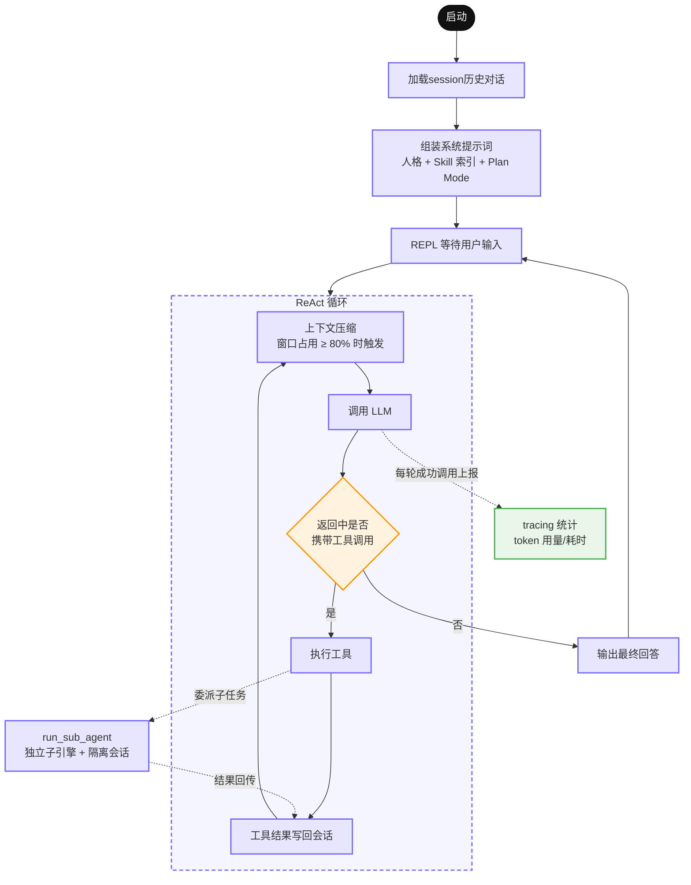

<div align="right">

**中文** | [English](./README_EN.md)

</div>

# LaxCode

[](https://github.com/mikellxy/laxcode-cli/actions/workflows/test.yml)

LaxCode 是一个用 Go 实现的轻量 AI Agent。它不依赖任何第三方 Agent 框架。基于 ReAct 推理循环，支持**工具调用、子 Agent 委派、上下文压缩、会话持久化与断点续聊、tracing 监控扩展**。

## 目录
- [1. 使用](#1-使用)
- [2. session 管理](#2-session-管理)
- [3. 工具](#3-工具)
- [4. 上下文压缩](#4-上下文压缩)
- [5. Plan Mode](#5-plan-mode)
- [6. Tracing 扩展](#6-tracing-扩展)
- [7. 架构](#7-架构)

## 1. 使用
### 1.1 Go 版本
* **Go version**: LaxCode requires Go version 1.26 or above

### 1.2 模型配置（任意 OpenAI 兼容端点）
* **使用配置文件**
```shell
mkdir -p ~/.laxcode

touch ~/.laxcode/settings.json
```
配置文件写入
```json
{
  "OPENAI_API_KEY": "sk-xxxxxxxxxxxxxxxx",
  "OPENAI_BASE_URL": "https://api.openai.com/v1", # 任意 OpenAI 兼容端点
  "OPENAI_MODEL": "gpt-4o-mini",
  "OPENAI_CONTEXT_WINDOW": 128000,
  "OPENAI_MAX_OUTPUT_TOKENS": 16384,
  "LLM_ROUTER_ADDR": "127.0.0.1:0",
  "COMPACTION_OPENAI_MODEL": "gpt-4o-mini",
  "COMPACTION_OPENAI_CONTEXT_WINDOW": 128000,
  "COMPACTION_OPENAI_MAX_OUTPUT_TOKENS": 4096
}
```
* **使用环境变量**
```shell
export OPENAI_API_KEY=sk-xxxxxxxxxxxxxxxx
export OPENAI_BASE_URL=https://api.openai.com/v1     # 任意 OpenAI 兼容端点
export OPENAI_MODEL=gpt-4o-mini
export OPENAI_CONTEXT_WINDOW=128000
export OPENAI_MAX_OUTPUT_TOKENS=16384
# 默认 127.0.0.1:0；需要从外部访问路由器时改成固定端口
export LLM_ROUTER_ADDR=127.0.0.1:18080
# 压缩 provider 的未配置项会继承主 provider
export COMPACTION_OPENAI_MODEL=gpt-4o-mini
```

### 1.3 终端交互模式
  

```shell
make build

./bin/laxcode
```
命令行参数  

| 参数 | 默认 | 说明                                          |
| --- | --- |-----------------------------------------------|
| `-session <id>` | 空 | 续聊指定会话；空则新建（id 为毫秒精度时间串） |
| `-plan` | false | 开启 Plan Mode（见下）                        |
| `-workdir` | cwd | 工作目录                                      |

### 1.4 one-shot 模式
```shell
make build

./bin/laxcode -workdir=/tmp/laxcode-example -oneshot -session=20260828-165219.532 -task="我们之前都聊了什么?"

# stdout 结构化输出：
# {"session_id":"20260828-165219.532","result":"根据当前对话记录，我们只进行了一轮交互，内容如下：\n\n## 已完成的对话内容\n\n**你提出的任务：** 实现一个 Python ping-pong HTTP server。\n\n**我做的事情：**\n1. **查看环境** — 检查了工作目录 `/tmp/laxcode-example`（当时为空）和 Python 版本（3.9.6）。\n2. **编写代码** — 创建了 `pingpong_server.py`，基于 Python 标准库 `http.server` 实现，无第三方依赖。\n3. **测试验证** — 启动服务器并对各端点做了实测：\n   - `GET /ping` → `pong`\n   - `GET /pong` → `ping`\n   - `POST /ping` → `pong`\n   - `GET /` → 交替返回 `ping`/`pong`\n   - `GET /health` → `{\"status\": \"ok\"}`\n   - 未知路径 → 404，不支持的方法 → 405\n4. **清理** — 删除了测试产生的日志文件。\n\n期间还遇到一个小插曲：初次测试用的 8765 端口被环境里其他进程占用导致绑定失败，后改用 8877 端口验证通过。\n\n---\n\n如果你指的是**更早之前的对话**（不在本次会话上下文中），我这边没有保留那些历史记录——每次会话都是独立的，我无法访问之前的对话内容。如果你想继续，可以告诉我新需求，比如：\n- 给服务器加 WebSocket ping/pong 支持\n- 增加鉴权、限流、自定义路由\n- 打包成可部署的 Docker 镜像等\n\n需要的话随时说 😊","token_used":{"token_input":27835,"token_output":4074},"window_token":{"token_input":6348,"token_output":445},"error":null}
```
命令行参数

| 参数            | 默认  | 说明                                          |
|-----------------|-------|-----------------------------------------------|
| `-session <id>` | 空    | 续聊指定会话；空则新建（id 为毫秒精度时间串） |
| `-plan`         | false | 开启 Plan Mode（见下）                        |
| `-workdir`      | cwd   | 工作目录                                      |
| `-oneshot`      | false | 开启 oneshot 模式                               |
| `-task`         | 空    | prompt 文本                                    |
| `-task-file`    | 空    | prompt 文件，优先级高于 `-task`                  |

### 1.5 workflow-agent 混合架构示例
```shell
make

pip3 install langgraph langchain-openai python-dotenv

python3 ./examples/workflow-agent-hybrid/example.py -workdir=/tmp/laxcode-example -session=xxxxx -task="how to use meta Class in python? Just give me a text answer first"
```

### 1.6 sse
```shell
./bin/laxcode -sse -workdir /tmp/laxcode-example -addr 127.0.0.1:8080
go run ./examples/sse-client -task "列出当前目录并统计 go 文件数量"
go run ./examples/sse-client -task "我们都聊了什么" -session=20260910-142622.514
```

无论使用交互、one-shot 还是 SSE 模式，进程都会同时启动本地模型路由器，主
`GenerateStream` 经 `POST /openai/generate_stream` 间接访问模型。路由器默认绑定
`127.0.0.1:0` 的随机空闲端口；如需从外部调用，请设置固定的 `LLM_ROUTER_ADDR`。
请求体采用 OpenAI Responses API 格式，服务端配置会覆盖请求里的 `model`：

```shell
LLM_ROUTER_ADDR=127.0.0.1:18080 ./bin/laxcode
curl -N http://127.0.0.1:18080/openai/generate_stream \
  -H 'Content-Type: application/json' \
  -d '{"input":"hello"}'
```

| 参数       | 默认  | 说明                |
|------------|-------|---------------------|
| `-sse`     | false | 启动 sse server     |
| `-addr`    | 空    | sse server 监听地址 |
| `-workdir` | cwd   | 工作目录            |

## 2. session 管理
支持通过指定 session id 进行断点续聊
```shell
make build

./bin/laxcode -session=xxxxx
```

### 2.1 session 持久化
session 目录结构
```text
${workdir}/.laxcode/
├── sessions.db                # SQLite：会话状态、当前工作集和完整历史
└── .session/
    └── ${session_id}/
        ├── history.jsonl       # 原始消息的 best-effort 本地冷备
        ├── artifacts/          # 按内容 SHA-256 保存的不可变工具输出
        ├── log/
        │   └── tracing.log     # OTel span 本地落盘 JSON LINES
        ├── plan.md             # [Plan Mode] 任务规划（agent 生成）
        ├── design.md           # [Plan Mode] 执行任务清单（agent 生成）
        └── archive/            # [Plan Mode] 完成任务的归档目录
            └── <plan_mode_task_name>/
```

### 2.2 运行日志

进程启动时使用标准库 `log/slog` 创建 `./log/laxcode.log`，以 JSON Lines 追加写入 INFO 及以上日志。上下文达到压缩阈值时记录 `context_compaction_triggered`，成功提交后记录 `context_compaction_completed`；失败记录 `context_compaction_failed`。日志只包含 token、消息数量、调用组、artifact、保护区和耗时等统计，不记录消息正文或工具输出。

模型路由器单独写入 `./log/llmrouter.log`；每次请求包含 slog 自动生成的 `time`，
以及 `request_body_bytes`、`duration_ms`、`status_code` 字段，不记录请求正文或 API key。

## 3. 工具
LaxCode 在 ReAct 循环中完整实现 openai function call 协议。启动时默认注入内置工具，并在每轮调用 llm 时发送工具定义
所有工具内部对路径进行安全解析，杜绝路径穿越  

### 3.1 read_file

| 参数 | 类型 | 说明 |
| --- | --- | --- |
| `path` | string | 工作目录内的相对路径 |
| `start_line_no` | int | 起始行号，1‑based |
| `start_bytes` | int | 起始行内字节偏移，1‑based |

单次读取存在上限。工具返回附带自描述翻页状态，模型可自主完成超长文件分页续读，无需预判文件总长度。

### 3.2 write_file

| 参数 | 类型 | 说明 |
| --- | --- | --- |
| `path` | string | 相对路径，父目录不存在时自动创建 |
| `content` | string | 完整文件内容 |

创建或整体覆写文件，返回写入路径供模型确认。

### 3.3 edit_file

| 参数 | 类型 | 说明 |
| --- | --- | --- |
| `path` | string | 已存在文件的相对路径 |
| `old_text` | string | 待替换原文 |
| `new_text` | string | 替换后内容 |

针对 LLM 输出文本缩进、换行符差异问题，edit_file 实现**四级宽容降级匹配**，大幅降低因文本微小偏差导致的修改失败。

### 3.4 bash

| 参数 | 类型 | 说明 |
| --- | --- | --- |
| `command` | string | 在工作目录下执行的 bash 命令 |

面向 Agent 场景的边界处理：

- 内置超时控制，超时归类为可恢复错误；
- 结构化返回退出码、标准输出；区分命令执行失败与进程运行故障。

### 3.5 run_sub_agent

| 参数 | 类型 | 说明 |
| --- | --- | --- |
| `task` | string | 完整、独立的子任务描述，不依赖父对话上下文 |
| `abstract` | string | 50 字以内摘要（用于终端展示） |
| `work_dir` | string | 可选，缺省继承父 Agent 工作目录 |

- 派发子任务进行复杂任务探索，子 Agent 拥有独立上下文缓冲区，父 Agent 仅接收最终摘要结果，不用携带中间试错过程
- 子 Agent 可以单独设置一套独立人格、系统提示词、权限范围，和主 Agent 职责解耦

## 4. 上下文压缩

每次调用 LLM 前，按当前模型预算计算下一请求占用，包含消息与工具定义。触发阈值仍是可用输入容量的 80%，压缩目标仍是 60%。兼容 provider 不支持远端计数时使用本地估算，估算不等同于精确计数。系统先执行确定性的 `simpleStrategy`；本地压缩仍无法达到目标时，才调用 `COMPACTION_OPENAI_*` 配置的 provider 生成结构化摘要。压缩 provider 的未配置项继承主 provider。

- 一条 assistant 发起的全部工具调用及其结果组成一个 `ToolCallGroup`。从最近第三组的起点到历史末尾，所有消息保持原样，区间内的 assistant 消息可以超过三条；未完成或跨界调用组使保护区向前扩展。
- 保护区之前的大工具输出先存入 artifact，再替换为带 `artifact_id` 和 `read_artifact` 调用提示的引用。读取工具按 Unicode 字符偏移分页，单次最多 4000 字符，校验内容摘要并限制在当前会话内。
- 旧 reasoning 可清除，旧 assistant 正文做 UTF-8 安全的头尾裁剪。本地压缩耗尽后，系统消息与保护区之间的历史会合并为一条结构化 user 摘要；系统消息和保护区保持不变。候选上下文重新计数达标后才提交；失败保留当前上下文，且不发送生成请求。
- `Session` 只持有最新 `RequestContext`。SQLite 仅使用 `request_contexts` 和 `messages`：每条新消息原子写入不可变 original 与当前 memory generation；压缩时完整创建下一 generation 后切换 head，旧代封存。original 提交成功后再 best-effort 追加到 `history.jsonl`，冷备失败不影响会话。
- system 首次创建时与其他消息一样占用 session 内递增的 `Seq`，后续启动只更新当前 generation 的 memory，不改 original、不分配新 Seq。`OriginalSeq` 是严格升序的数组：普通消息只包含自身，摘要消息包含所有被合并原文的去重来源；摘要 `Seq` 取来源中的最小值。中断状态及缺失工具结果直接由消息尾部和 `ToolCallID` 推导。

## 5. Plan Mode

`‑plan` 启动时注入一套强制的串行工作流，所有规划状态强制持久化到文件而非内存：

1. **plan.md** —— 理解目标后写完整方案（需求点、技术选型、边界风险）；
2. **design.md** —— 拆为小粒度可执行清单；
3. 逐条执行，**真正完成一条才能打钩**，禁止提前打钩、虚构完成；
4. 全部完成后将两份文档归档到 `archive/<任务名>/`。

## 6. Tracing 扩展
laxcode 只依赖 OpenTelemetry API 模块，本体不提供真实上报后端的实现。默认由内置 filetrace 把 span 以 JSON Lines 落盘到 `${workdir}/.laxcode/.session/${session_id}/log/tracing.log`（见 2.1 节）。如需把 trace 上报到自建监控后端，按以下规范实现自定义 Handle：

1. 实现 `trace.TracerProvider` / `trace.Tracer` / `trace.Span` 三个接口。接口是密封的（含未导出标记方法），须内嵌 `go.opentelemetry.io/otel/trace/embedded` 包中的对应接口来满足。`Span.End()` 是上报触发点——每次 span 结束被同步调用一次，实现内不要做阻塞 IO（建议只入队，后台 goroutine 批量发送）。
2. 入口文件放入 `internal/infrastructure/tracing/custom/` 包，在 `func init()` 中调用 `tracing.Register("<name>", tracing.New(provider))` 注册——组合根 cmd/agentasm 已空导入该包，init 随进程启动自动执行。
3. provider 实现 `Shutdown(context.Context) error` 方法时，进程退出前会被自动探测调用，用于 flush 尾部 span（one-shot 进程存活时间可能短于批量导出周期，必须靠它兜底）。
4. 注册成功的自定义 Handle 自动优先于默认 filetrace 被选用（无需启动参数）；未注册任何实现时缺省为 filetrace 本地落盘。

## 7. 架构
代码按 DDD 分层组织，依赖方向为 `cmd → application → domain ← infrastructure`。

```
LaxCode/
├── cmd/
│   ├── main/              # 入口：解析配置，分流交互 / one-shot 模式
│   ├── agentasm/          # 组合根：装配 session/tracer/tools/provider/ReActService
│   ├── run_cli/           # 交互模式前端（REPL 循环、信号处理）
│   └── run_oneshot/       # one-shot 模式前端（结果 JSON 契约输出、exit code）
├── internal/
│   ├── application/
│   │   ├── reactservice/  # ReAct 推理循环、子 Agent 委派
│   │   └── llm_router/    # 本地模型网关 HTTP/SSE 编排
│   ├── domain/
│   │   ├── session/       # 会话聚合、SessionRepository 仓储接口
│   │   ├── tools/         # 工具注册表与 read/write/edit/bash 行为契约，WorkFS / ShellRunner 端口
│   │   ├── llmprovider/   # LLM 客户端接口
│   │   ├── llmrouter/     # 网关上游流式端口
│   │   ├── prompt/        # 系统提示词组装（人格 / Skill 索引 / Plan Mode），SkillSource 端口
│   │   ├── compactor/     # 上下文压缩策略
│   │   ├── telemetry/     # 观测词汇表：span 名、属性键、追踪辅助函数
│   │   └── sharedkernel/  # 消息、工具定义、token 统计与估算等共享类型
│   └── infrastructure/
│       ├── llmprovider/   # OpenAI Responses 协议实现
│       ├── llmrouter/     # 网关 OpenAI SDK 流式适配器
│       ├── sessionrepo/   # 会话文件仓储（JSONL 落盘）
│       ├── workfs/        # WorkFS 端口的真实文件系统实现
│       ├── shell/         # ShellRunner 端口实现：exec、进程组、超时杀进程
│       ├── skillrepo/     # SkillSource 端口实现：扫描 .laxcode/skills
│       ├── layout/        # 磁盘布局单一真源（.laxcode / .session / skills / tracing.log）
│       ├── config/        # 配置加载（环境变量 / 配置文件 / CLI 参数）
│       ├── cliprinter/    # 终端打印
│       └── tracing/       # OTel 封装、filetrace 落盘、custom 扩展点
└── openspec/              # 开发过程中的变更管理文档
```


