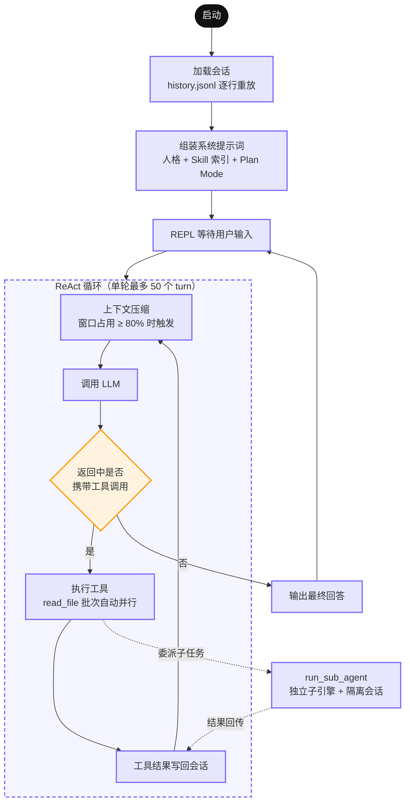

# LaxCode
LaxCode 是一个用 Go 从零实现的终端 AI 编程 Agent。它不依赖任何第三方 Agent 框架，在一个约 4000 行的代码库里完整实现了编码助手的核心闭环：**ReAct 推理循环、工具调用、子 Agent 委派、上下文压缩、会话持久化与断点续聊**。

项目的目标不是复刻商业产品的功能广度，而是把每个子系统都做到工程上站得住：状态有唯一真相源、故障路径有恢复策略、给模型的每一份输入都经过严谨设计。



---

## 模型适配说明

LaxCode 遵循 OpenAI‑compatible API 协议，同时原生支持 Anthropic 接口，可接入绝大多数主流推理基座。

- **推荐基座：GLM‑5.3 / DeepSeek‑V4‑Pro**
  GLM‑5.3 具备优秀的长链路规划、工具调用与编码能力，原生支持 reasoning‑content 深度思考输出；在超长 ReAct 循环、嵌套子Agent场景下模型偶发不稳定问题，由 Runtime 层提供校验、容错、错误恢复兜底。
- 兼容 Claude、以及其余 OpenAI‑兼容模型；不同基座 Function‑Call 稳定性存在差异，部分模型需要微调系统提示词。

>
> 提示：大模型本身会存在幻觉、工具调用格式异常等问题。本项目内置安全校验、消息完整性保护、结构化错误反馈等 Runtime 缓解机制，但无法做到 100% 消除模型侧缺陷。

---

## 1. 架构

```
LaxCode/
├── cmd/main/              # 入口：装配 registry、provider、engine
├── internal/
│   ├── engine/            # ReAct 循环、会话管理、工具调度、子 Agent
│   ├── provider/          # LLM 接口抽象 + OpenAI 兼容 / Anthropic 双实现
│   ├── context/           # 系统提示词组装、Skill 索引、上下文压缩、错误提示协议
│   ├── tools/             # 工具注册表与 read/write/edit/bash 实现
│   ├── schema/            # 与模型交互的消息、工具定义等中立数据结构
│   ├── utils/             # 分页读取等无状态基础设施
│   └── env/               # 配置加载
└── openspec/              # 开发过程中的变更管理文档
```

各包之间依赖方向单一：`engine` 依赖 `provider`/`tools`/`context`，反向依赖为零；`schema` 作为中立消息结构被所有层引用，provider 实现负责在厂商 SDK 格式与内部格式之间互转。
这意味着切换模型厂商不影响引擎逻辑，新增工具不需要触碰引擎代码。

### 1.1 启动与会话加载

会话持久化的设计原则是**单一真相源 + 可推导的冗余**：

- 每条消息（用户输入、模型回复、工具结果）追加即落盘为 `.laxcode/.session/<session-id>/history.jsonl` 中的一行 JSON，内存与磁盘始终同步；
- token 统计快照 `meta.json` 是纯冗余数据，供人直接查看；快照缺失、损坏或滞后都不影响正确性——恢复时以 history.jsonl 的单遍重放为准，重放同时推导出累计 token 消耗与窗口占用；
- 坏行跳过并告警，绝不阻断启动；
- 系统提示词属于派生数据，不写入历史文件，每次启动按当前代码版本与 Skill 集合重建——续聊时提示词模板或技能有更新即刻生效，不存在过期缓存问题。

用 `-session <id>` 启动即续聊指定会话，缺省则以毫秒精度时间串新建。

### 1.2 系统提示词组装

系统提示词在启动时按需拼装，只包含与本次运行相关的段：

```
flowchart LR
    A["Agent 人格<br/>+ 沙箱路径约束<br/>（内嵌模板）"] --> out["最终系统提示词"]
    B["Skill 索引<br/>.laxcode/skills/*<br/>（有技能才注入）"] --> out
    C["Plan Mode 工作流<br/>（-plan 开启才注入）"] --> out
```

>
> **Skill 机制：遵循 Anthropic 渐进式披露（progressive‑disclosure）范式**
> 系统提示词里只注入每个技能的一行索引（名称 + 简短描述），技能正文不会载入上下文；模型判断任务相关时，主动读取 `SKILL.md` 文件再按其指引执行工作。该方案将「技能数量增长」与「上下文 token 成本」解耦。
> 技能加载自带完整校验管线；任何技能解析失败只告警跳过，不会阻断 Agent 启动。

### 1.3 ReAct 循环

`engine.Run` 驱动「推理 → 工具调用 → 观察」循环直到模型给出无工具调用的最终回答：

- **历史唯一真相源是会话对象**：每次调用 LLM 前重拼发送视图，所有消息经统一入口追加写回；
- **turn 上限 50**：触发上限后返回哨兵错误，REPL 打印警告，不会静默失控退出；
- **read_file 批次自动并行**：模型一次性返回多个只读文件工具调用时，并发执行，结果严格按原始调用顺序归位；含写操作的批次退化为顺序执行，避免竞态风险。

### 1.4 子 Agent

`run_sub_agent` 工具把可拆分的独立子任务委派给一个全新构造的子引擎：

- 子 Agent 拥有**独立的工具注册表**（仅 bash + read_file，无写权限）与**独立会话**；父对话历史完全不传入——既隔离了上下文，也避免子任务撑爆父窗口；
- 子 Agent 失败时，已产出的部分结果仍会交还父 Agent，供其判断补救方向，而不是整个子任务作废。

### 1.5 上下文压缩

长会话中工具输出会迅速吃满窗口。压缩器在每次调用 LLM 前检查窗口占用，达到阈值（默认窗口的 80%）时分层清理：

- 近期工具输出做内容截断保留关键头尾；
- 更早的工具输出替换为简要摘要；
- 过期的模型推理思考链（reasoning‑content）直接清除；
- 压缩仅作用于发送给大模型的内存视图，原始会话历史完整保存在磁盘。

### 1.6 Provider 抽象

`provider.Provider` 接口只有 `Generate` 一个核心方法。当前提供两个实现：OpenAI 兼容协议（DeepSeek 等）与 Anthropic。引擎与工具层完全不感知厂商差异。

---

## 2. 工具

所有文件类工具共享同一套**沙箱约束**：路径统一经 `safeJoinWorkDir` 解析，显式拒绝绝对路径、校验解析结果必须落在工作目录内，杜绝 `../` 路径穿越。工具参数用 JSON Schema 完整声明并随工具定义提供给模型。

### 2.1 read_file

| 参数 | 类型 | 说明 |
| --- | --- | --- |
| `path` | string | 工作目录内的相对路径 |
| `start_line_no` | int | 起始行号，1‑based |
| `start_bytes` | int | 起始行内字节偏移，1‑based |

单次读取存在上限。工具返回附带自描述翻页状态，模型可自主完成超长文件分页续读，无需预判文件总长度。

### 2.2 write_file

| 参数 | 类型 | 说明 |
| --- | --- | --- |
| `path` | string | 相对路径，父目录不存在时自动创建 |
| `content` | string | 完整文件内容 |

创建或整体覆写文件，返回写入路径供模型确认。

### 2.3 edit_file

| 参数 | 类型 | 说明 |
| --- | --- | --- |
| `path` | string | 已存在文件的相对路径 |
| `old_text` | string | 待替换原文 |
| `new_text` | string | 替换后内容 |

针对 LLM 输出文本缩进、换行符差异问题，edit_file 实现**四级宽容降级匹配**，大幅降低因文本微小偏差导致的修改失败。

### 2.4 bash

| 参数 | 类型 | 说明 |
| --- | --- | --- |
| `command` | string | 在工作目录下执行的 bash 命令 |

面向 Agent 场景的边界处理：

- 内置超时控制，超时归类为可恢复错误；
- 输出截断时保证不会切断多字节字符造成乱码；
- 结构化返回退出码、标准输出；区分命令执行失败与进程运行故障。

### 2.5 run_sub_agent

| 参数 | 类型 | 说明 |
| --- | --- | --- |
| `task` | string | 完整、独立的子任务描述，不依赖父对话上下文 |
| `abstract` | string | 50 字以内摘要（用于终端展示） |
| `work_dir` | string | 可选，缺省继承父 Agent 工作目录 |

见 [1.4 子 Agent](#14-%E5%AD%90-agent)。

### 2.6 错误反馈协议：让模型从错误中恢复

Agent 系统里工具失败是常态，盲目重试相同调用会消耗大量 Token 与 Turn 预算。LaxCode 为此实现了**结构化错误提示协议**：
每一类工具错误附带一份定向纠错提示返回给大模型，引导模型修正参数，禁止原样重试失败调用。系统提示词同步声明该协议，建立「错误 → 诊断 → 定向恢复」的闭环，保障长任务稳定跑完。

---

## 3. 使用

### 3.1 构建与运行

```
make build          # 编译到 bin/laxcode
make test           # 单元测试
make vet            # 静态检查

export OPENAI_API_KEY=sk‑...
export OPENAI_BASE_URL=https://api.deepseek.com     # 任意 OpenAI 兼容端点
export OPENAI_MODEL=deepseek‑chat

./bin/laxcode
```

### 3.2 命令行参数

| 参数 | 默认 | 说明 |
| --- | --- | --- |
| `-session <id>` | 空 | 续聊指定会话；空则新建（id 为毫秒精度时间串） |
| `-plan` | false | 开启 Plan Mode（见下） |
| `-debug` | false | 输出调试日志 |

REPL 内输入 `exit` 或 Ctrl‑D 退出。

### 3.3 Plan Mode

`‑plan` 启动时注入一套强制的串行工作流，所有规划状态强制持久化到文件而非内存：

1. **plan.md** —— 理解目标后写完整方案（需求点、技术选型、边界风险）；
2. **design.md** —— 拆为小粒度可执行清单；
3. 逐条执行，**真正完成一条才能打钩**，禁止提前打钩、虚构完成；
4. 全部完成后将两份文档归档到 `archive/<任务名>/`。

每次进入 Plan Mode 的第一个强制动作是探测目录中是否已有 plan.md/design.md——存在则续跑未完成的任务。这让中断（会话结束、进程退出）天然可恢复，任务进度以文件为准，不依赖对话历史。

### 3.4 Skills

在工作目录放置 `.laxcode/skills/<name>/SKILL.md` 即注册一个技能：

```
---
name: pdf‑tools
description: 处理 PDF 的技能
---
（正文：任务说明）
```

---

## 4. 自研模块范围 & 外部依赖

>
> 清晰划分项目自研 Runtime 底座与外部依赖边界

### ✅ LaxCode 自研模块

- Agent Runtime 调度内核：完整 ReAct 循环、会话状态管理、消息生命周期
- 分层工具框架：Engine / Runner / Registry 分层架构，解决 SubAgent 循环依赖问题
- SubAgent 子任务调度：支持 Tool‑模式子Agent，预留 Graph 编排扩展能力
- PlanMode 任务规划执行、任务中断恢复、归档逻辑
- 内置工具实现：read_file / write_file / edit_file / bash / run_sub_agent
- Runtime 安全层：工作目录沙箱、危险命令校验、输入输出错误分层封装
- 稳定性防护：多级超时控制、上下文消息完整性保护、各类边界异常处理
- 可观测能力：Token统计、工具调用埋点、子任务链路信息
- Skill 渐进披露框架（兼容 Anthropic 技能范式）

### 📦 外部依赖（不属于本项目自研）

- OpenAI / Anthropic 兼容 API client：负责与 LLM 模型网络通信
- Go 标准库以及第三方基础库：日志、yaml解析等通用基础组件