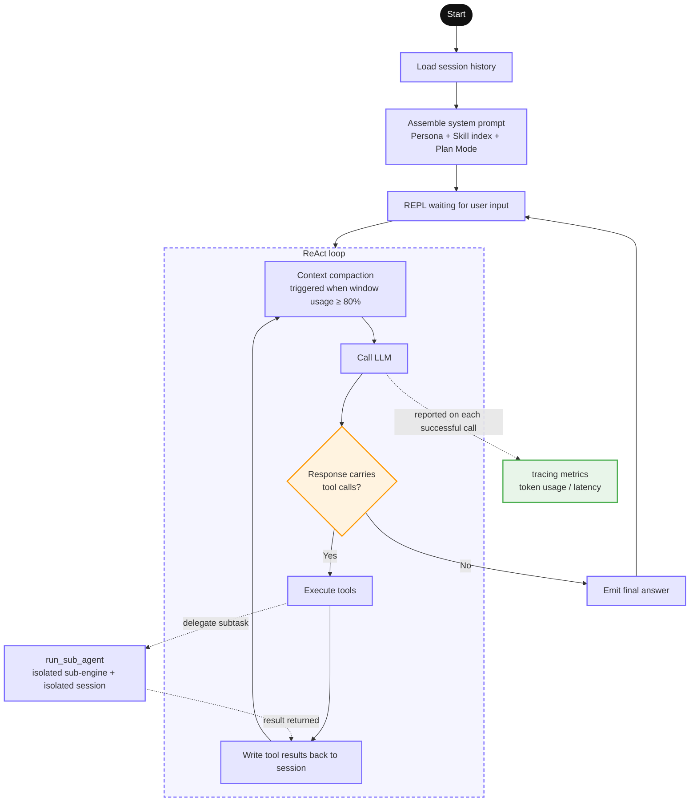

<div align="right">

[中文](./README.md) | **English**

</div>

# LaxCode

[](https://github.com/mikellxy/laxcode-cli/actions/workflows/test.yml)

LaxCode is a lightweight AI Agent implemented in Go. It does not depend on any third-party agent framework. Built on the ReAct reasoning loop, it supports **tool calling, sub-agent delegation, context compaction, session persistence & resume, and tracing extensions**.

## Table of Contents
- [1. Usage](#1-usage)
- [2. Session Management](#2-session-management)
- [3. Tools](#3-tools)
- [4. Context Compaction](#4-context-compaction)
- [5. Plan Mode](#5-plan-mode)
- [6. Tracing Extension](#6-tracing-extension)
- [7. Architecture](#7-architecture)

## 1. Usage
### 1.1 Go Version
* **Go version**: LaxCode requires Go version 1.26 or above

### 1.2 Model Configuration (any OpenAI-compatible endpoint)
* **Using a config file**
```shell
mkdir -p ~/.laxcode

touch ~/.laxcode/settings.json
```
Write the following into the config file
```json
{
  "OPENAI_API_KEY": "sk-xxxxxxxxxxxxxxxx",
  "OPENAI_BASE_URL": "https://api.openai.com/v1", # any OpenAI-compatible endpoint
  "OPENAI_MODEL": "gpt-4o-mini"
}
```
* **Using environment variables**
```shell
export OPENAI_API_KEY=sk-xxxxxxxxxxxxxxxx
export OPENAI_BASE_URL=https://api.openai.com/v1     # any OpenAI-compatible endpoint
export OPENAI_MODEL=gpt-4o-mini
```

### 1.3 Interactive Terminal Mode
```shell
make build

./bin/laxcode
```
Command-line arguments  

| Argument | Default | Description |
| --- | --- | --- |
| `-session <id>` | empty | Resume the given session; empty creates a new one (id is a millisecond-precision timestamp string) |
| `-plan` | false | Enable Plan Mode (see below) |
| `-workdir` | cwd | Working directory |

<a href="examples/laxcode_terminal_interaction.png"></a>

### 1.4 One-shot Mode
```shell
make build

./bin/laxcode -workdir=/tmp/laxcode-example -oneshot -session=20260828-165219.532 -task="What did we talk about before?"

# Structured output on stdout:
# {"session_id":"20260828-165219.532","result":"Based on the current conversation, we only had one round of interaction, summarized below:\n\n## Completed conversation content\n\n**The task you gave:** implement a Python ping-pong HTTP server.\n\n**What I did:**\n1. **Inspect the environment** — checked the working directory `/tmp/laxcode-example` (empty at the time) and the Python version (3.9.6).\n2. **Write the code** — created `pingpong_server.py` based on the Python standard library `http.server`, with no third-party dependencies.\n3. **Test & verify** — started the server and tested each endpoint:\n   - `GET /ping` → `pong`\n   - `GET /pong` → `ping`\n   - `POST /ping` → `pong`\n   - `GET /` → alternates `ping`/`pong`\n   - `GET /health` → `{\"status\": \"ok\"}`\n   - unknown path → 404, unsupported method → 405\n4. **Clean up** — removed the log files produced during testing.\n\nThere was also a small hiccup: port 8765 used in the first test was occupied by another process in the environment, causing the bind to fail; switching to port 8877 passed verification.\n\n---\n\nIf you meant **even earlier conversations** (not in this session's context), I have no record of them — each session is independent and I cannot access previous conversation content. If you want to continue, just tell me a new request, for example:\n- add WebSocket ping/pong support to the server\n- add authentication, rate limiting, custom routes\n- package it as a deployable Docker image, etc.\n\nLet me know anytime 😊","token_used":{"token_input":27835,"token_output":4074},"window_token":{"token_input":6348,"token_output":445},"error":null}
```
Command-line arguments

| Argument        | Default | Description |
|-----------------|---------|-------------|
| `-session <id>` | empty   | Resume the given session; empty creates a new one (id is a millisecond-precision timestamp string) |
| `-plan`         | false   | Enable Plan Mode (see below) |
| `-workdir`      | cwd     | Working directory |
| `-oneshot`      | false   | Enable one-shot mode |
| `-task`         | empty   | Prompt text |
| `-task-file`    | empty   | Prompt file, takes precedence over `-task` |

### 1.5 workflow-agent Hybrid Architecture Example
```shell
make

pip3 install langgraph langchain-openai python-dotenv

python3 ./examples/workflow-agent-hybrid/example.py -workdir=/tmp/laxcode-example -session=xxxxx -task="how to use meta Class in python? Just give me a text answer first"
```

## 2. Session Management
Resuming a conversation from a previous run is supported by specifying a session id
```shell
make build

./bin/laxcode -session=xxxxx
```

### 2.1 Session Persistence
Session directory layout
```text
${workdir}/.laxcode/.session/
└── ${session_id}/
    ├── history.jsonl           # conversation history, JSON LINES
    ├── meta.json               # token usage stats, context window records
    ├── log/
    │   └── tracing.log         # OTel spans persisted locally as JSON LINES
    ├── plan.md                 # [Plan Mode] task plan (generated by the agent)
    ├── design.md               # [Plan Mode] executable task checklist (generated by the agent)
    └── archive/                # [Plan Mode] archive directory for completed tasks
        └── <plan_mode_task_name>/
```

## 3. Tools
LaxCode fully implements the OpenAI function call protocol inside the ReAct loop. Built-in tools are injected at startup, and tool definitions are sent with every LLM call.
All tools parse paths safely internally, preventing path traversal.  

### 3.1 read_file

| Argument | Type | Description |
| --- | --- | --- |
| `path` | string | Relative path within the working directory |
| `start_line_no` | int | Starting line number, 1‑based |
| `start_bytes` | int | Byte offset within the starting line, 1‑based |

A single read has a size limit. The tool response carries a self-describing pagination state, so the model can page through very long files on its own without guessing the total file length.

### 3.2 write_file

| Argument | Type | Description |
| --- | --- | --- |
| `path` | string | Relative path; parent directories are created when missing |
| `content` | string | Full file content |

Creates or fully overwrites a file and returns the written path for the model to confirm.

### 3.3 edit_file

| Argument | Type | Description |
| --- | --- | --- |
| `path` | string | Relative path of an existing file |
| `old_text` | string | Original text to replace |
| `new_text` | string | Replacement content |

To cope with indentation and line-ending differences in LLM output, edit_file implements **four-level tolerant fallback matching**, greatly reducing edit failures caused by minor text deviations.

### 3.4 bash

| Argument | Type | Description |
| --- | --- | --- |
| `command` | string | Bash command executed in the working directory |

Edge handling tailored for agent scenarios:

- Built-in timeout control; a timeout is classified as a recoverable error;
- Structured return of exit code and stdout; distinguishes command failure from process-level faults.

### 3.5 run_sub_agent

| Argument | Type | Description |
| --- | --- | --- |
| `task` | string | A complete, self-contained subtask description, independent of the parent conversation |
| `abstract` | string | Summary within 50 characters (for terminal display) |
| `work_dir` | string | Optional; defaults to the parent agent's working directory |

- Dispatches subtasks for exploring complex tasks. The sub-agent owns an isolated context buffer; the parent agent only receives the final summary, without carrying the trial-and-error process
- A sub-agent can have its own persona, system prompt and permission scope, decoupled from the main agent's responsibilities

## 4. Context Compaction
The compactor checks window usage before every LLM call and, once the threshold (80% of the window by default) is reached, cleans up in layers:  
- Recent tool outputs are truncated, keeping the key head and tail;
- Older tool outputs are replaced with brief summaries;
- Expired model reasoning chains (reasoning‑content) are removed outright;
- Compaction only affects the in-memory view sent to the LLM; the original conversation history is fully preserved on disk.

## 5. Plan Mode

Starting with `‑plan` injects an enforced serial workflow, and all planning state is forcibly persisted to files rather than kept in memory:

1. **plan.md** — after understanding the goal, write the complete plan (requirements, technical choices, boundary risks);
2. **design.md** — break it down into a fine-grained executable checklist;
3. Execute item by item; **an item may only be ticked once it is truly done** — ticking ahead or fabricating completion is forbidden;
4. After everything is done, archive both documents into `archive/<task_name>/`.

## 6. Tracing Extension
laxcode only depends on the OpenTelemetry API module and does not ship an implementation of a real reporting backend. By default the built-in filetrace persists spans as JSON Lines to `${workdir}/.laxcode/.session/${session_id}/log/tracing.log` (see section 2.1). To report traces to your own observability backend, implement a custom Handle following the conventions below:

1. Implement the three interfaces `trace.TracerProvider` / `trace.Tracer` / `trace.Span`. The interfaces are sealed (they contain unexported marker methods) and must be satisfied by embedding the corresponding interfaces from the `go.opentelemetry.io/otel/trace/embedded` package. `Span.End()` is the reporting trigger — it is called synchronously once every time a span ends, so avoid blocking IO in the implementation (enqueue only, and batch-send from a background goroutine).
2. Put the entry file in the `internal/infrastructure/tracing/custom/` package and register it in `func init()` by calling `tracing.Register("<name>", tracing.New(provider))` — the composition root cmd/agentasm already blank-imports this package, so init runs automatically at process startup.
3. If the provider implements the `Shutdown(context.Context) error` method, it is auto-detected and invoked before process exit to flush trailing spans (a one-shot process may live shorter than the batch export interval, so this is the required safety net).
4. A registered custom Handle is automatically preferred over the built-in filetrace (no startup argument needed); when nothing is registered, the default is local filetrace persistence.

## 7. Architecture
The codebase follows DDD layering, with dependencies flowing `cmd → application → domain ← infrastructure` (domain depends on no other layer):

```
LaxCode/
├── cmd/
│   ├── main/              # entrypoint: parses config, dispatches interactive / one-shot mode
│   ├── agentasm/          # composition root: assembles session/tracer/tools/provider/ReActService
│   ├── run_cli/           # interactive-mode frontend (REPL loop, signal handling)
│   └── run_oneshot/       # one-shot-mode frontend (result JSON contract, exit codes)
├── internal/
│   ├── application/
│   │   └── reactservice/  # ReAct reasoning loop, sub-agent delegation
│   ├── domain/
│   │   ├── session/       # session aggregate, SessionRepository interface
│   │   ├── tools/         # tool interfaces & registry, read/write/edit/bash implementations
│   │   ├── llmprovider/   # LLM client interface
│   │   ├── prompt/        # system prompt assembly (persona / skill index / Plan Mode)
│   │   └── sharedkernel/  # shared types: messages, tool definitions, token stats
│   ├── infrastructure/
│   │   ├── llmprovider/   # OpenAI Responses protocol implementation
│   │   ├── sessionrepo/   # filesystem session repository (JSONL persistence)
│   │   ├── compactor/     # context compaction
│   │   ├── config/        # configuration loading (env vars / config file / CLI flags)
│   │   ├── cliprinter/    # terminal printing
│   │   └── tracing/       # OTel wrapper, filetrace persistence, custom extension point
│   └── utils/             # stateless infrastructure such as paginated reading
└── openspec/              # change-management docs produced during development
```


